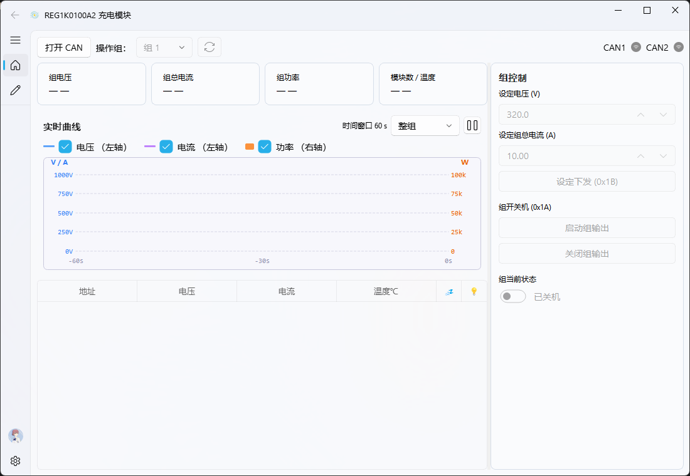

<div align="center">

# infypower-tools

[English](#english) · [简体中文](#简体中文)

[](LICENSE)


[](https://github.com/bayley/infypower-tools-en/stargazers)

</div>

---

## English

> English-UI edition of [MisakaMikoto128/infypower-tools](https://github.com/MisakaMikoto128/infypower-tools). All user-facing strings have been translated to English; the protocol, hardware and build flow are unchanged.



A Windows desktop console for **INFYPOWER REG1K0100A2** charging modules (1000V / 100A / 30kW), built with PyQt-Fluent-Widgets. Implements the vendor's published **CAN protocol V1.09**, with multi-group control, per-module monitoring, real-time charts, and a full-protocol manual command console.

### Features

- **Group-level control**: switch between up to 15 groups; one-click power on/off, set output V/I, Walk-In enable, green LED blink, module sleep
- **Module table**: live per-module V/I/alarms/sleep/LED state with a 4-state lifecycle (pending / online / offline / gone)
- **Real-time chart**: group aggregate ↔ single-module view, dynamic N-axis range, auto-reset on target module disappearance
- **Manual command panel**: send any protocol command `0x01`–`0x1F` with auto-generated parameter dialogs
- **Dual CAN channels**: CAN1 / CAN2 activity badges + chained RX decoding (0x09 system V/I, 0x04 module status, 0x08 system fixed-point V/I, etc.)
- **Configurable**: `config.json` controls V/I ranges, max group count, poll interval, module timeouts

### Screenshots

| Home (multi-group aggregate) | Manual console | Real-time chart |
|---|---|---|
|  |  |  |

### Hardware

- ZLG USBCAN-2A / USBCAN-II adapter (uses the bundled `ControlCAN.dll`)
- One or more INFYPOWER **REG1K0100A2** modules (other INFYPOWER models implementing CAN protocol V1.09 should work in theory, untested)
- Windows 10 / 11, Python 3.10+

### Install & Run

```bash
pip install -r requirements.txt
python main.py
```

### Build

The repo ships several packaging scripts:
- `build_nuitka.bat` / `build_nuitka_debug.bat` — Nuitka compile
- `python build.py` — custom build flow
- `make_package.bat` — legacy PyInstaller flow (main.spec)

### Protocol Reference

The full CAN protocol spec is in [`doc/充电模块CAN通讯协议V1.09 20240510.md`](doc/充电模块CAN通讯协议V1.09%2020240510.md) (PDF in the same folder). The spec is only available in Chinese from the vendor.

### Project Structure

```
.
├── main.py                # App entry point (FluentWindow + system tray)
├── home_widget.py         # Home: multi-group aggregate view + module table + real-time chart
├── manual_widget.py       # Manual command console (protocol 0x01–0x1F)
├── chart_widget.py        # RealtimeChart (whole-group / single-module switch)
├── module_table.py        # Per-group module table + custom delegates
├── group_state.py         # GroupState / ModuleState dataclasses + 4-state lifecycle
├── group_poller.py        # Chained scheduler for group- and module-level polling with RX decoding
├── REG1K0100A2.py         # Protocol layer: send helpers + RxEvent + listeners
├── HDL_CAN.py             # ctypes wrapper around ZLG ControlCAN.dll
├── config_manager.py      # AppConfig dataclass + JSON loader
├── config.json            # User-editable configuration
├── tests/                 # pytest unit tests (with MockCAN fixture)
├── doc/                   # Protocol PDF/MD + screenshots
└── requirements*.txt
```

### Tests

```bash
pip install -r requirements-dev.txt
pytest -q
```

Tests don't need USBCAN hardware — they use a `MockCAN` fixture in `tests/conftest.py`.

### License

[GPL-3.0](LICENSE)

### Third-party Notice

`ControlCAN.dll` is © **Guangzhou ZLG (Zhiyuan Electronics)**. It is bundled here purely as a convenience for one-click reproducibility, NOT as a redistribution license. If the rights holder objects, please open an issue or email the author and it will be removed immediately. Readers may also download the driver from ZLG's official website.

### Acknowledgements

- [MisakaMikoto128/infypower-tools](https://github.com/MisakaMikoto128/infypower-tools) — the original project this edition is translated from
- [PyQt-Fluent-Widgets](https://github.com/zhiyiYo/PyQt-Fluent-Widgets) — beautiful Fluent Design Qt widgets
- ZLG ControlCAN — USBCAN device SDK
- INFYPOWER — public CAN protocol spec

---

## 简体中文

> 本仓库是 [MisakaMikoto128/infypower-tools](https://github.com/MisakaMikoto128/infypower-tools) 的英文界面版本。界面文字已全部翻译为英文，协议、硬件与打包流程保持不变。


英飞源 INFYPOWER 充电模块（型号 **REG1K0100A2**，1000V / 100A / 30kW）的 Windows 桌面控制台。基于 PyQt-Fluent-Widgets，按厂家公开的 **CAN 通讯协议 V1.09** 实现，支持多组管理、模块级监控、实时图表，以及全协议命令的手动控制台。

### 功能特性

- **组级控制**：在最多 15 个组之间切换；一键开/关机、设输出电压/电流、Walk-In 使能、绿灯闪烁、模块休眠
- **模块表**：组内每模块的电压/电流/告警/休眠/绿灯状态实时刷新，支持 4 态生命周期（pending/online/offline/gone）
- **实时图表**：整组聚合 ↔ 单模块切换，N-动态量程，目标模块消失时自动重置
- **手动命令面板**：协议表 `0x01`–`0x1F` 全命令任发，参数对话框按命令定义自动生成
- **双 CAN 通道**：CAN1 / CAN2 活动徽章 + 链式 RX 解码（0x09 系统电压电流、0x04 模块状态、0x08 系统定点电压电流 等）
- **可配置**：`config.json` 调电压/电流量程、组数上限、轮询周期、模块超时阈值

### 截图

| 主页（多组聚合视图） | 手动命令面板 | 实时图表 |
|---|---|---|
|  |  |  |

### 硬件要求

- 周立功 USBCAN-2A / USBCAN-II 系列板卡（依赖随包附带的 `ControlCAN.dll`）
- 一台或多台英飞源 **REG1K0100A2** 充电模块（其它沿用同一 CAN 协议 V1.09 的英飞源型号也理论可用，未实测）
- Windows 10 / 11，Python 3.10+

### 安装运行

```bash
pip install -r requirements.txt
python main.py
```

### 打包

仓库附带多套打包脚本：
- `build_nuitka.bat` / `build_nuitka_debug.bat` — Nuitka 编译
- `python build.py` — 自定义打包流程
- `make_package.bat` — 旧 PyInstaller 流程（main.spec）

### 协议参考

完整 CAN 协议规范见 [`doc/充电模块CAN通讯协议V1.09 20240510.md`](doc/充电模块CAN通讯协议V1.09%2020240510.md)（PDF 同目录）。

### 项目结构

```
.
├── main.py                # 应用入口（FluentWindow + 系统托盘）
├── home_widget.py         # 主页：多组聚合视图 + 模块表 + 实时图表
├── manual_widget.py       # 手动命令面板（协议 0x01–0x1F）
├── chart_widget.py        # RealtimeChart（整组 / 单模块切换）
├── module_table.py        # 组内模块表格 + 自定义 Delegate
├── group_state.py         # GroupState / ModuleState 数据类 + 4 态生命周期
├── group_poller.py        # 链式调度组级 + 模块级命令的 RX 解码轮询器
├── REG1K0100A2.py         # 协议层：发送 helper + RxEvent + listener
├── HDL_CAN.py             # 周立功 ControlCAN.dll 的 ctypes 封装
├── config_manager.py      # AppConfig 数据类 + JSON 加载
├── config.json            # 用户可编辑配置
├── tests/                 # pytest 单测（含 MockCAN fixture）
├── doc/                   # 协议 PDF/MD + 截图
└── requirements*.txt
```

### 测试

```bash
pip install -r requirements-dev.txt
pytest -q
```

测试不依赖 USBCAN 硬件，使用 `tests/conftest.py` 的 `MockCAN` fixture 注入。

### License

[GPL-3.0](LICENSE)

### 第三方版权声明

`ControlCAN.dll` 版权归 **广州周立功（致远电子）** 所有，本仓库为方便读者一键运行将其附带，并非授权再发布。如版权方有异议，请通过 GitHub Issue 或邮件联系作者，会在第一时间移除。读者也可自行从周立功官网下载对应版本驱动。

### 鸣谢

- [MisakaMikoto128/infypower-tools](https://github.com/MisakaMikoto128/infypower-tools) — 本版本翻译自的原始项目
- [PyQt-Fluent-Widgets](https://github.com/zhiyiYo/PyQt-Fluent-Widgets) — 漂亮的 Fluent Design Qt 组件库
- 周立功 ControlCAN — USBCAN 设备 SDK
- 英飞源 INFYPOWER — 公开的 CAN 协议规范
